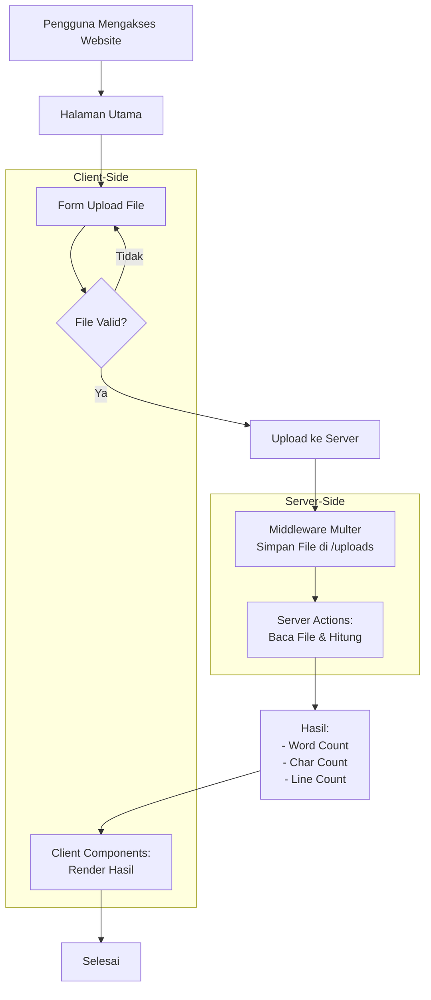

# Word Count Analyzer 📊

  
  
  
  
  

Aplikasi web yang dibuat dengan ExpressJS yang menganalisis berkas teks (.txt) dan menyediakan statistik jumlah kata, jumlah karakter, dan jumlah baris. Dilengkapi dengan fungsi pengunggahan berkas dan antarmuka pengguna yang bersih.

## ✨ Fitur 
- **Unggah File**: Unggah file `.txt` apa pun untuk analisis 
- **Statistik Teks**: Hitung jumlah kata, jumlah karakter (tidak termasuk spasi), dan jumlah baris 
- **UI Sederhana**: Antarmuka yang ramah pengguna dengan desain responsif 
- **Titik Akhir API**: Dibuat dengan rute RESTful untuk potensi integrasi 

## 🛠️ Tumpukan Teknologi 
- **Backend**: Node.js + ExpressJS 
- **Frontend**: Template EJS + JavaScript vanilla 
- **Middleware**: Multer (unggah file), file statis Express 
- **Penerapan**: Siap untuk Vercel/Heroku (tambahkan konfigurasi Anda sendiri)
  

## 🚀 Mulai Cepat 
1. Kloning repo ini 
2. Instal dependensi: `npm install` 
3. Jalankan aplikasi: `node app.js` 
4. Akses di `http://localhost:3000` 

## 📝 Kasus Penggunaan Ideal 
- Penulis konten memeriksa panjang artikel 
- Siswa menganalisis metrik dokumen 
- Pengembang menguji logika pemrosesan teks 

🔗 *Dapat diadaptasi sebagai proyek awal untuk menambahkan lebih banyak fitur NLP!*

